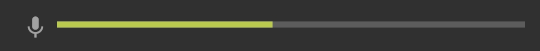
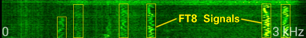
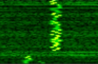
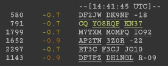
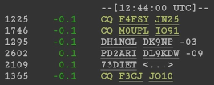

# Troubleshooting

This page focuses on the usage of the Android app **FT8RX**.

General resources about FT8 can be found on [Joe Taylor's website](https://physics.princeton.edu/pulsar/k1jt/wsjtx.html) and countless others on the internet.

## In case you can't get any results

Now, before you go to the Play-Store and give me a 1-star review, please try the following steps. ;-)

### 1. Make sure your radio is tuned in to a well-known FT8 frequency, and you can hear FT8 signals.

### 2. Make sure the app is receiving audio data:

You can see this by checking the bar at the top, next to the microphone icon. It should look like this:

The signals should also be visible in the spectrometer:

Note: The yellow outline is not shown in the app.

If the app is not receiving audio data:

- make sure FT8RX has microphone permissions
- try to restart the app
- try other Android audio sources in FT8RX' settings menu (e.g.: _"Default"_, _"Microphone"_ or _"Unprocessed"_).

### 3. Make sure the time settings are correct:

Start by pressing `RESET Δt` one single time. If your phone has correct time settings you'll be seeing the first results after one complete pass (if you're unlucky this may take up to 29 seconds).

Unfortunately, often the phone's clock is just off way too much, and you may not receive a single report. Sometimes, this is clearly visible in the spectrogram:

In this example, both signals were received way too early. In fact, during the next pass the left signal will end up looking like the right one. Both signals end up being useless to the decoder.

Browse to [time.is](https://time.is). This website will tell you if your phone's time is correct. If not, you have two options:

#### A) Adjust your phone's clock to the correct value

This is probably the worst way to do it, since you'd have to turn off Android's automatic time synchronization to do so. Furthermore, fine adjustments aren't easy to do, and you'd have to switch between Android settings and FT8RX all the time to see the effect.

#### B) Use FT8RX' time delta functionality to compensate for your phone's clock inaccuracy

FT8RX has its own clock that can be adjusted comfortably without having to change the phone's clock. Its starting point is your phone's clock. From there, we apply a delta which you can see in the lower left corner of the app.

For example, if [time.is](https://time.is) reports that your clock is 1.3 seconds behind, you should increase FT8RX' time delta by pressing the `+0.1s` button until you see `FT8RX Δt 1.3s` in the lower left corner. Hopefully now you should start seeing results after the next pass.

Important note: Android will modify your phone's time settings sooner or later. In this case, your `FT8RX Δt`-value may become invalid and you will have to adjust it again.

### 4. Fine-Tuning

You can (and should) further fine tune your clock towards the incoming signals. Example:

Here we can see that most signals were received with a time delta of -0.7 to -0.9 seconds. This means these signals were received too early (our clock is most likely lagging behind). You can fine tune this by pressing the `+0.1s` button until you see `FT8RX Δt 0.8s` in the lower left corner. After one pass you'll see that the next signals received are much closer to zero:

Why is this important? Because all signals received earlier than -1.2s or later than +1.2s can't be decoded.
